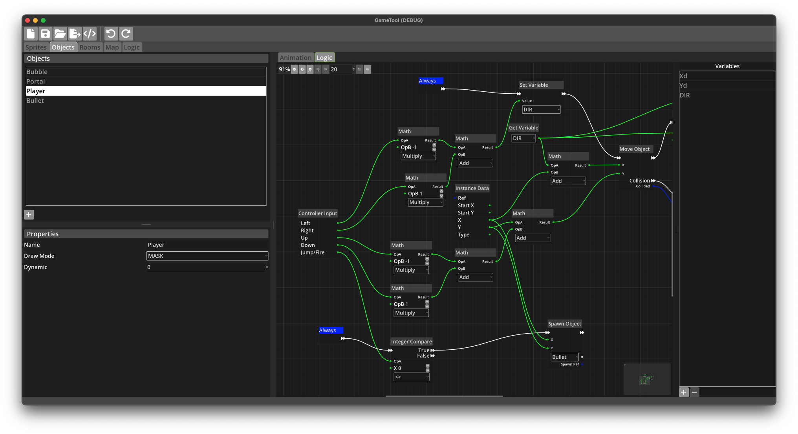

# kwyll_tests

[Kwyll](https://www.kwyll.com/) is a game creator by
[Paul Gregory](https://www.youtube.com/playlist?list=PLXeWQa8fW6oZQWJvommPLxv5pU24T5BLL).
It'd based on the [Godot engine](https://godotengine.org/). Paul's developed it with the
specific intention of making a graphical game creator for, initially, the ZX Spectrum
computer from the 1980s, a machine I retain great affection for.

Kwyll is a graphical programming engine, which, at least in theory, requires no programming
skill. I'm not entirely convinced by that claim, but my humble opinion and all that.

Logic is implemented with graphs using a GUI:

I took an interest in Kwyll because, although as a text-editor-and-make kind of developer
it's not really my thing, I'd never used the approach and wanted to learn more. It's good.
Actually, it's really good. I'm not sure I could live with using it every day, given it's
intrinsically limiting and way above the sort of development level I typically work at, but
I get the idea now. I can see how this can be used to create massive modern games. Not on
the Spectrum, though. :)

This repository contains bunch of tests and experiments I wrote while dabbling with Kwyll.
They may be useful to someone. It's all in the public domain, you can do what you like
with it.

[Derek Fountain](https://www.derekfountain.org/), October 2025